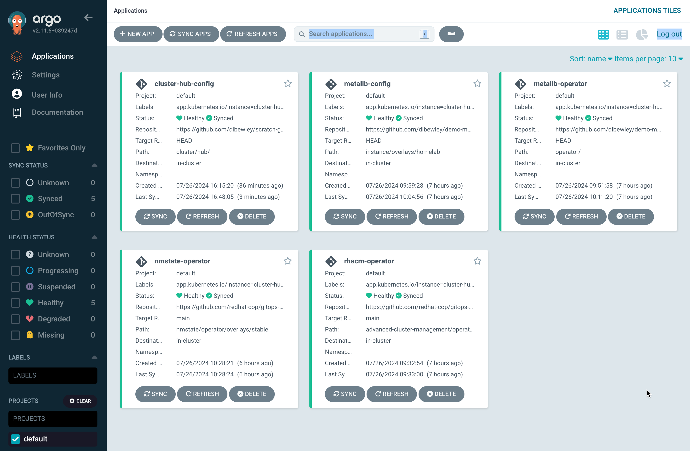

# Step 1

## Setup ArgoCD

* Install 'Red Hat OpenShift GitOps' Operator using all the defaults.
* Add someone to the 'cluster-admins' _OCP_ group
* Add cluster-admins to 'admin' _ArgoCD_ group

# Given this setup

Argo-apps/ holds Applications which may (probably do) point off to remote git repositories.

<details>
<summary>File structure of repository</summary>
```
$ tree -L 4 .
 .
├──  argo-apps
│   ├──  cfg
│   │   ├──  homelab-net
│   │   │   ├──  application.yaml
│   │   │   └──  kustomization.yaml
│   │   ├──  local-storage
│   │   │   ├──  application.yaml
│   │   │   └──  kustomization.yaml
│   │   ├──  metallb
│   │   │   ├──  application.yaml
│   │   │   └──  kustomization.yaml
│   │   ├──  nmstate
│   │   │   ├──  application.yaml
│   │   │   └──  kustomization.yaml
│   │   ├──  odf
│   │   │   ├──  application.yaml
│   │   │   └──  kustomization.yaml
│   │   ├──  readme.md
│   │   └──  rhacm
│   ├──  olm
│   │   ├──  kustomization.yaml
│   │   ├──  local-storage
│   │   │   ├──  application.yaml
│   │   │   └──  kustomization.yaml
│   │   ├──  metallb
│   │   │   ├──  application.yaml
│   │   │   └──  kustomization.yaml
│   │   ├──  nmstate
│   │   │   ├──  application.yaml
│   │   │   └──  kustomization.yaml
│   │   ├──  odf
│   │   │   ├──  application.yaml
│   │   │   └──  kustomization.yaml
│   │   ├──  readme.md
│   │   ├──  rhacm
│   │   │   ├──  application.yaml
│   │   │   └──  kustomization.yaml
│   │   └──  virtualization
│   │       ├──  application.yaml
│   │       └──  kustomization.yaml
│   └──  readme.md
├──  cluster
│   ├──  agent
│   │   ├──  application.yaml
│   │   ├──  kustomization.yaml
│   │   └──  readme.md
│   ├──  hub
│   │   ├──  application.yaml
│   │   ├──  kustomization.yaml
│   │   └──  readme.md
│   └──  readme.md
├──  configs
│   ├──  hyperconverged.yaml
│   ├──  lightspeed
│   │   ├──  olsconfig.yaml
│   │   └──  secret.yaml
│   ├──  local-storage
│   │   ├──  kustomization.yaml
│   │   └──  localvolumeset.yaml
│   └──  odf
│       ├──  kustomization.yaml
│       ├──  readme.md
│       ├──  role.yaml
│       ├──  rolebinding.yaml
│       └──  storagecluster.yaml
└──  readme.md
```
</details>

# Create [the argo app](cluster/hub/application.yaml) to manage the 'hub' cluster 

This will also create the other apps referenced via the [kustomization](cluster/hub/kustomization.yaml). Should they be abstracted further? What's an app of apps? https://argo-cd.readthedocs.io/en/stable/operator-manual/cluster-bootstrapping/#app-of-apps-pattern

```bash
$ oc apply -k cluster/hub
application.argoproj.io/cluster-hub-config configured
application.argoproj.io/metallb-operator configured
application.argoproj.io/metallb-config configured
application.argoproj.io/nmstate-operator configured
application.argoproj.io/rhacm-operator configured
```

# Manually sync the apps in the ArgoCD UI and then:

```bash
$ oc get application.argoproj.io -A
NAMESPACE          NAME                 SYNC STATUS   HEALTH STATUS
openshift-gitops   cluster-hub-config   Synced        Healthy
openshift-gitops   metallb-config       Synced        Healthy
openshift-gitops   metallb-operator     Synced        Healthy
openshift-gitops   nmstate-operator     Synced        Healthy
openshift-gitops   rhacm-operator       Synced        Healthy
```



# Create [the argo app](cluster/agent/application.yaml) to manage the 'agent' cluster 
